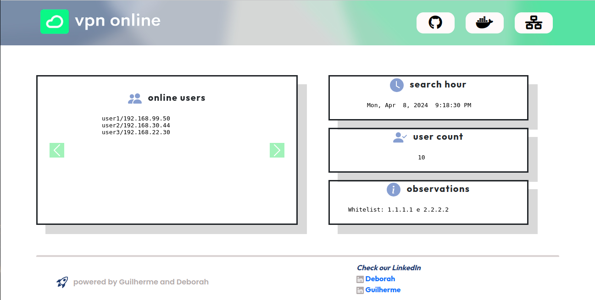
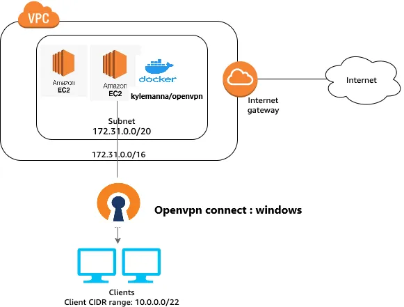

# Projeto frontvpn

O OpenVPN em Docker oferece uma solução flexível e escalável para implementar redes privadas virtuais (VPNs). Ao encapsular o OpenVPN em um contêiner Docker, os usuários podem facilmente implantar, gerenciar e escalar suas instâncias de VPN em qualquer ambiente compatível com Docker, seja localmente em máquinas individuais ou em ambientes de nuvem. Essa abordagem permite a rápida criação de VPNs seguras e personalizadas, garantindo a proteção dos dados transmitidos entre diferentes dispositivos e redes. Com recursos de isolamento fornecidos pelo Docker, juntamente com a flexibilidade do OpenVPN, as organizações podem garantir a segurança e a privacidade de suas comunicações, independentemente do tamanho ou da complexidade da infraestrutura de rede.


## Tecnologias utilizadas

 - [Linux]()
 - [FrontVPN Dockerhub]()
 - [ Kylemana Openvpn Dockerhub](https://hub.docker.com/r/kylemanna/openvpn)
 
 
 


## Motivação

Automação de projetos para a entrega contínua de sistemas focado em CICD

## Guilherme Soares

- [@guilhermesoares](https://www.github.com/guilhermesgit)
- [@deborahmaia](https://www.github.com/)

## Instalando o Openvpn em docker

Linux
```bash

docker-compose run --rm openvpn ovpn_genconfig -u udp://IpPublico
docker-compose run --rm openvpn ovpn_initpki
digite uma senha: da vpn
chown -R $(whoami): ./openvpn-data
docker-compose up -d openvpn

Criar certificado:
variavel do certificado: export CLIENTNAME="teste"
Cria certificado: docker-compose run --rm openvpn easyrsa build-client-full $CLIENTNAME nopass
docker-compose run --rm openvpn ovpn_getclient $CLIENTNAME > $CLIENTNAME.ovpn


```
## Rodando as aplicações

Para rodar as aplicações é necessário instalar docker

Linux
```bash
docker compose up -d
```
Testando a instalação
```bash

curl -I http://localhost:7039 ou http://localhost:7039
```

```
## Adicionar no crontab do usuário para rodar o script de atualização

*/5 * * * * user  cron/vpnatualiza.sh


## Documentação


[Kylemanna/OpenVPN](https:// https://hub.docker.com/r/kylemanna/openvpn)

[Front VPN](https://)

## Características

- Automação de infraestrutra
- Entrega de infraestrutra mais rápida
- Padronização de códigos e trabalho em equipe

## Tecnologias utilizadas

**Client:** Ubuntu, Docker

**Server:** EC2, docker


## Suporte

Para suporte entre em contato nos seguintes linkedins: